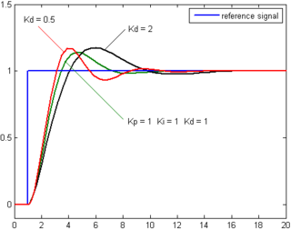

# Steering Control Using PID Controller

The basic idea behind a PID controller is to read a sensor, then compute the desired actuator output by calculating proportional, integral, and derivative responses and summing those three components to compute the output.

## Proportional Response

The proportional component depends only on the difference between the set point and the process variable. This difference is referred to as the Error term (CTE). The proportional gain (Kp) determines the ratio of output response to the error signal. For instance, if the error term has a magnitude of 10, a proportional gain of 5 would produce a proportional response of 50. In general, increasing the proportional gain will increase the speed of the control system response. However, if the proportional gain is too large, the process variable will begin to oscillate. If Kp is increased further, the oscillations will become larger and the system will become unstable and may even oscillate out of control.

For our particular case here this behaviour reflected in the aggressive steers when I used only proportional gain of value Kp = 1 and then started to decrease it to get a slower steering response while increasing the differential coeff in parallel. I ended up wiht Kp = 0.125, The following clip shows how sharp the steers are when I used (Kp = 1, Ki = 0, Kd = 0):

[](https://youtu.be/qY6YrJIEFag "Aggressive Steering")

## Integral Response
The integral component sums the error term over time. The result is that even a small error term will cause the integral component to increase slowly. The integral response will continually increase over time unless the error is zero, so the effect is to drive the Steady-State error to zero. Steady-State error is the final difference between the process variable and set point. A phenomenon called integral windup results when integral action saturates a controller without the controller driving the error signal toward zero.

Since the simulator doesn't simulate the biased scenario, I didn't need to set an integral coeff to complete one lap over the track. 


## Derivative Response

The derivative component causes the output to decrease if the process variable is increasing rapidly. The derivative response is proportional to the rate of change of the process variable. Increasing the derivative time (Td) parameter will cause the control system to react more strongly to changes in the error term and will increase the speed of the overall control system response. Most practical control systems use very small derivative time (Td), because the Derivative Response is highly sensitive to noise in the process variable signal. If the sensor feedback signal is noisy or if the control loop rate is too slow, the derivative response can make the control system unstable


This diagram shows how the derivative response affects the controlled variable and slows down the proportional response: 



## Hyperparameters Tuning Discussion
Using the manual tuning(Trial & Error), I've started with all the gains Kp= Ki = Kd = 0, then I started to add a proportional gain = 1, and carefully observed the steering behaviour until the vehicle left the drivable lane (It drove for like 2~3 seconds inside the lane before the steers got aggresive due to the overshooting). After that I started adding a dervative gain Kd = 1 to damp these overshoots and observed the behaviour again, the dervative response slowed the proportional response causing the overshoots to be less aggressive but the vehicle still leaving the lane at certain point(After ~ 5 seconds), after that I kept decreasing the proportional gain and increasing the drevative one until I reached the optimal gains mentioned below where the car didn't leave the lane for the whole lap and the steers are smoother (Not sharp/aggressive) as possible.

For our particular case here, this reflected in noticeablly damping the sharp steers, also since the simulator doesn't simulate the sensor noise, I had no problem to increase the Kd to damp the sharp steers as possible (Started by Kd = 1 and ended up with Kd = 3) as shown in the following clip (Final Tuned Params: Kp= 0.125, Ki = 0, Kd = 3 (Tuning Method: Manually "Trial & Error")):

[](https://youtu.be/F6KKNCOa9FA "PID Controlled Steering")

---

## Dependencies

* cmake >= 3.5
 * All OSes: [click here for installation instructions](https://cmake.org/install/)
* make >= 4.1(mac, linux), 3.81(Windows)
  * Linux: make is installed by default on most Linux distros
  * Mac: [install Xcode command line tools to get make](https://developer.apple.com/xcode/features/)
  * Windows: [Click here for installation instructions](http://gnuwin32.sourceforge.net/packages/make.htm)
* gcc/g++ >= 5.4
  * Linux: gcc / g++ is installed by default on most Linux distros
  * Mac: same deal as make - [install Xcode command line tools]((https://developer.apple.com/xcode/features/)
  * Windows: recommend using [MinGW](http://www.mingw.org/)
* [uWebSockets](https://github.com/uWebSockets/uWebSockets)
  * Run either `./install-mac.sh` or `./install-ubuntu.sh`.
  * If you install from source, checkout to commit `e94b6e1`, i.e.
    ```
    git clone https://github.com/uWebSockets/uWebSockets 
    cd uWebSockets
    git checkout e94b6e1
    ```
    Some function signatures have changed in v0.14.x. See [this PR](https://github.com/udacity/CarND-MPC-Project/pull/3) for more details.
* Simulator. You can download these from the [project intro page](https://github.com/udacity/self-driving-car-sim/releases) in the classroom.

There's an experimental patch for windows in this [PR](https://github.com/udacity/CarND-PID-Control-Project/pull/3)

## Basic Build Instructions

1. Clone this repo.
2. Make a build directory: `mkdir build && cd build`
3. Compile: `cmake .. && make`
4. Run it: `./pid`. 

Tips for setting up your environment can be found [here](https://classroom.udacity.com/nanodegrees/nd013/parts/40f38239-66b6-46ec-ae68-03afd8a601c8/modules/0949fca6-b379-42af-a919-ee50aa304e6a/lessons/f758c44c-5e40-4e01-93b5-1a82aa4e044f/concepts/23d376c7-0195-4276-bdf0-e02f1f3c665d)

## Editor Settings

We've purposefully kept editor configuration files out of this repo in order to
keep it as simple and environment agnostic as possible. However, we recommend
using the following settings:

* indent using spaces
* set tab width to 2 spaces (keeps the matrices in source code aligned)

## Code Style

Please (do your best to) stick to [Google's C++ style guide](https://google.github.io/styleguide/cppguide.html).

## Project Instructions and Rubric

Note: regardless of the changes you make, your project must be buildable using
cmake and make!

More information is only accessible by people who are already enrolled in Term 2
of CarND. If you are enrolled, see [the project page](https://classroom.udacity.com/nanodegrees/nd013/parts/40f38239-66b6-46ec-ae68-03afd8a601c8/modules/f1820894-8322-4bb3-81aa-b26b3c6dcbaf/lessons/e8235395-22dd-4b87-88e0-d108c5e5bbf4/concepts/6a4d8d42-6a04-4aa6-b284-1697c0fd6562)
for instructions and the project rubric.

## Hints!

* You don't have to follow this directory structure, but if you do, your work
  will span all of the .cpp files here. Keep an eye out for TODOs.

## Call for IDE Profiles Pull Requests

Help your fellow students!

We decided to create Makefiles with cmake to keep this project as platform
agnostic as possible. Similarly, we omitted IDE profiles in order to we ensure
that students don't feel pressured to use one IDE or another.

However! I'd love to help people get up and running with their IDEs of choice.
If you've created a profile for an IDE that you think other students would
appreciate, we'd love to have you add the requisite profile files and
instructions to ide_profiles/. For example if you wanted to add a VS Code
profile, you'd add:

* /ide_profiles/vscode/.vscode
* /ide_profiles/vscode/README.md

The README should explain what the profile does, how to take advantage of it,
and how to install it.

Frankly, I've never been involved in a project with multiple IDE profiles
before. I believe the best way to handle this would be to keep them out of the
repo root to avoid clutter. My expectation is that most profiles will include
instructions to copy files to a new location to get picked up by the IDE, but
that's just a guess.

One last note here: regardless of the IDE used, every submitted project must
still be compilable with cmake and make./

## How to write a README
A well written README file can enhance your project and portfolio.  Develop your abilities to create professional README files by completing [this free course](https://www.udacity.com/course/writing-readmes--ud777).

